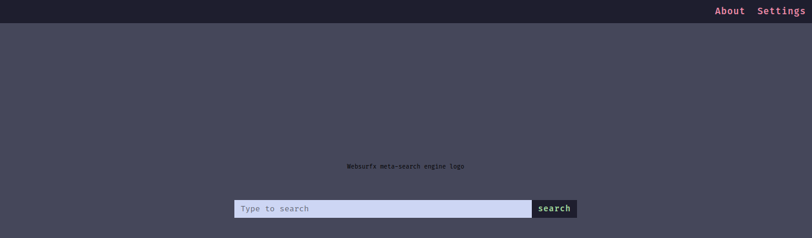

<h1 align="center">Websurfx</h1>
<p align="center">
  <i>
    A modern-looking, lightning-fast, privacy-respecting, secure
    <a href="https://en.wikipedia.org/wiki/Metasearch_engine"
      >meta search engine</a
    >
    (pronounced as websurface or web-surface /wɛbˈsɜːrfəs/.) written in Rust. It
    provides a fast and secure search experience while respecting user
    privacy.</i
  >
  <br />
  <br />
  
  <br />
  <br />
  <b align="center"><a href="README.org">Readme</a></b> |
  <b><a href="https://discord.gg/k4GH2TnZ">Discord</a></b> |
  <b><a href="https://github.com/neon-mmd/websurfx">GitHub</a></b> |
  <b><a href="https://github.com/neon-mmd/websurfx/wiki">Documentation</a></b>
  <br /><br />
  <a href="./LICENSE">
    
  </a>
  <a href="https://github.com/neon-mmd/websurfx/stargazers">
    
  </a>
  <a href="https://github.com/neon-mmd/websurfx/forks">
    
  </a>
  <a href="#">
    
  </a>
  <a href="https://github.com/neon-mmd/websurfx/issues">
    
  </a>
  <a href="https://github.com/neon-mmd/websurfx/pulls">
    
  </a>
  <a href="https://github.com/neon-mmd/websurfx/actions">
    
  </a>
</p>

<details>
  <summary><b>Table of Contents</b></summary>
  <p>

- **Getting Started**
    - [🌈 Features](#features-)
    - [🔭 Preview](#preview-)
    - [🛠️ Installation and Testing](#installation-and-testing-)
    - [🔧 Configuration](#configuration-)
- **Feature Overview**
    - [🎨 Theming](#theming-)
    - [🌍 Multi-Language Support](#multi-language-support-)
- **Community**
    - [📊 System Requirements](#system-requirements-)
    - [🗨️ FAQ (Frequently Asked Questions)](#faq-frequently-asked-questions-)
    - [📣 More Contributers Wanted](#more-contributers-wanted-)
    - [💖 Supporting Websurfx](#supporting-websurfx-)
    - [📘 Documentation](#documentation-)
    - [🛣️ Roadmap](#roadmap-)
    - [🙋 Contributing](#contributing-)
    - [📜 License](#license-)
    - [🤝 Credits](#credits-)

  </p>
</details>

# Features 🌈 

- ⛔ Proper NSFW blocking
- 🎨 High level customizability with 9 colorchemes provided by default with a simple theme, also supporting creation of your custom themes and colorschemes very quickly and easily
- 🔍 Advanced image search
- 🔐 Fast, private and secure
- 🆓 100% free and open source
- 🌈 and lots more...

**[⬆️ Back to Top](#websurfx)**

# Preview 🔭 

## Main Page


## Search Page


## 404 Error Page


**[⬆️ Back to Top](#websurfx)**

# Installation and Testing 🛠️ 

> For full setup instructions, see: [**Installation**]()

To get started with Websurfx, clone the repository, edit the config file which is located in the `websurfx`{.verbatim} directory and install redis server by following the instructions located [here](https://redis.io/docs/getting-started/) and then run the websurfx server and redis server using the following commands:

``` shell
git clone https://github.com/neon-mmd/websurfx.git
cd websurfx
cargo build
redis-server -p 8082 &
./target/debug/websurfx
```

If you want to use the rolling/edge branch, run the following commands instead:

``` shell
git clone https://github.com/neon-mmd/websurfx.git
cd websurfx
git checkout rolling
cargo build
redis-server -p 8082 &
./target/debug/websurfx
```

Once you have started the server, open your preferred web browser and navigate to <http://127.0.0.1:8080> to start using Websurfx.

> **Warning**
> Please be aware that the project is still in the testing phase and is not ready for production use.

**[⬆️ Back to Top](#websurfx)**

# Configuration 🔧 

> For full configuration instructions, see: [**Configuration**]()

Websurfx is configured through the config.lua file, located at `websurfx/config.lua`.

**[⬆️ Back to Top](#websurfx)**

# Theming 🎨 

> For full theming and customization instructions, see: [**Theming**]()

Websurfx comes with several themes and colorschemes by default which you can apply and edit through the config file. Support for custom themes and colorschemes using css and develop your own unique-looking website.

**[⬆️ Back to Top](#websurfx)**

# Multi-Language Support 🌍

> **Note**
> Currently, we do not support other languages but in future we would start accepting contributions regarding language support because we believe that language should not be a barrier for entry.  

**[⬆️ Back to Top](#websurfx)**

# System Requirements 📊

At present, we only support all x86_64 architectures system but will love to have contributions to extend to other architectures as well.

**[⬆️ Back to Top](#websurfx)**

# FAQ (Frequently Asked Questions) 🗨️

## Why Websurfx?

The main goal of the Websurfx project is to provide a fast, secure, and privacy-focused [meta search engine](https://en.wikipedia.org/wiki/Metasearch_engine). While there are many meta search engines available, they do not always guarantee the security of their search engine, which is essential for ensuring privacy. For example, memory vulnerabilities can leak private or sensitive information, which is never good. Websurfx is written in Rust, which guarantees memory safety and eliminates such problems. Many meta search engines also lack key features such as advanced image search, which is required by many graphic designers, content creators, and others. Websurfx aims to provide these features and others, such as proper NSFW blocking, to improve the user experience.

## Why AGPLv3?

Websurfx is released under the **AGPLv3** license to ensure that the source code remains open and transparent. This helps to prevent the inclusion of spyware, telemetry, or other malicious code in the project. **AGPLv3** is a strong copyleft license that ensures the source code of the software remains open and available to everyone, including any modifications or improvements made to the code.

## Why Rust?

Rust was chosen as the programming language for Websurfx due to its memory safety features, which can help prevent vulnerabilities and make the codebase more secure. Rust is also faster than C++, which helps to make Websurfx fast and responsive. In addition, Rust\'s ownership and borrowing system allows for safe concurrency and thread safety in the codebase.

**[⬆️ Back to Top](#websurfx)**

# More Contributers Wanted 📣 

We are looking for more willing contributors to help grow this project.For more information on how you can contribute, check out the [project board](https://github.com/neon-mmd/websurfx/projects?query=is%3Aopen) and the [CONTRIBUTING.org](CONTRIBUTING.org) file for guidelines and rules for making contributions.

**[⬆️ Back to Top](#websurfx)**

# Supporting Websurfx 💖

> For full details and other ways you can help out, see: [**Contributing**]()

If you're using Dashy and would like to help support its development, then that would be awesome! Contributions of any type, any size, are always very much appreciated, and we will appropriately credit you for your effort.

Several areas that we need a bit of help with at the moment are:
- **Better and more colorchemes** - Help fix colorchemes and add other famous colorchemes.
- **Improve evasion code for bot detection** - Help improve code related to evade ip blocking and emulate human behaviours located in everyone engine file.
- **Logo** - Help create a logo for the project and website.
- **Docker Support** - Help write a docker compose file for the project.
- Submit a PR to add a new feature, fix a bug, update the docs, add a theme, widget or something else.
- Star Websurfx on GitHub.

**[⬆️ Back to Top](#websurfx)**

# Documentation 📘

> **Note**
> We are willing to have any contribution regarding [documentation](https://github.com/neon-mmd/websurfx/wiki) as this helps everyone using this project. 

**[⬆️ Back to Top](#websurfx)**

# Roadmap 🛣️

> Coming soon!! 🙂.

**[⬆️ Back to Top](#websurfx)**

# Contributing 🙋 

Contributions are welcome from anyone. It doesn\'t matter who you are; you can still contribute to the project in your way.

## Not a developer but still want to contribute?

Check out this [video](https://youtu.be/FccdqCucVSI) by Mr. Nick on how to contribute.

## Developer

If you are a developer, have a look at the [CONTRIBUTING.org](CONTRIBUTING.org) document for more information.

**[⬆️ Back to Top](#websurfx)**

# License 📜 

Websurfx is available under the [AGPLv3](LICENSE) license.

**[⬆️ Back to Top](#websurfx)**

# Credits 🤝 

We would like to thank the following people for their contributions and support:

<a href="https://github.com/neon-mmd/websurfx/graphs/contributors">

</a>

**[⬆️ Back to Top](#websurfx)**

---

<p align="center">
<a href="https://github.com/neon-mmd/websurfx">

</a>
<br><br>
<i>Thank you for Visiting</i>
</p>
