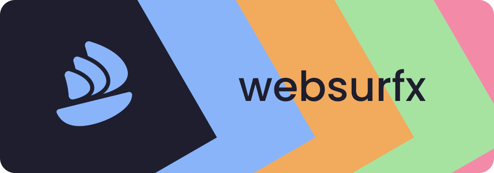
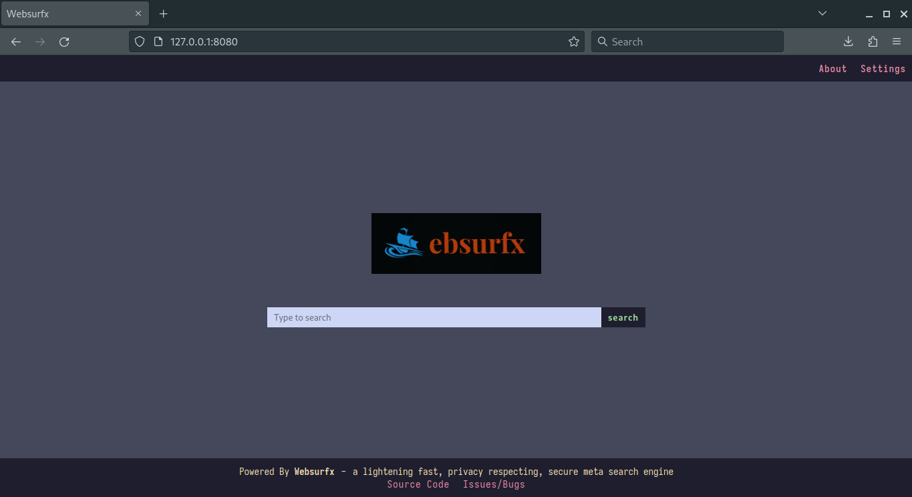
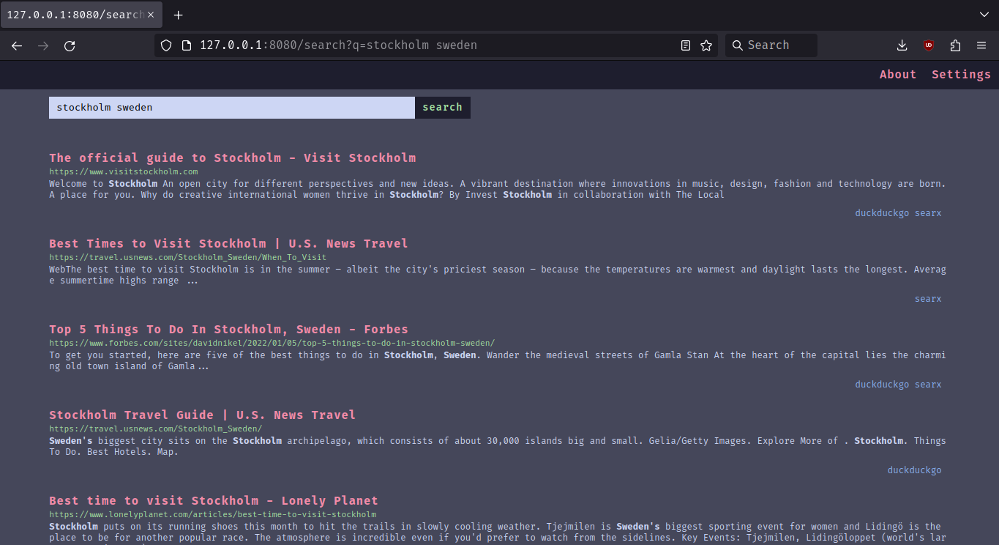
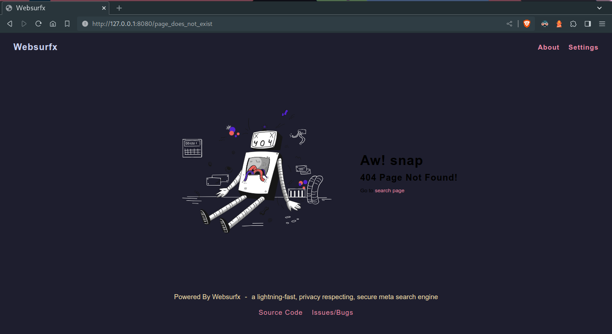

<h1 align="center">
  
</h1>
<p align="center">
  <b align="center"><a href="README.md">Readme</a></b> |
  <b><a href="https://discord.gg/SWnda7Mw5u">Discord</a></b> |
  <b><a href="https://github.com/neon-mmd/websurfx">GitHub</a></b> |
  <b><a href="./docs/README.md">Documentation</a></b>
  <br /><br />
  <a href="#">
    
  </a>
  <a href="https://github.com/neon-mmd/websurfx/actions">
    
  </a>
  <a href=""
    >
  </a>
  <a href="https://gitpod.io/#https://github.com/neon-mmd/websurfx">
    
  </a>
  <br />
  <br />
  <i>
    A modern-looking, lightning-fast, privacy-respecting, secure
    <a href="https://en.wikipedia.org/wiki/Metasearch_engine"
      >meta search engine</a
    >
    (pronounced as websurface or web-surface /wɛbˈsɜːrfəs/.) written in Rust. It
    provides a quick and secure search experience while maintaining user
    privacy.</i
  >
</p>

<details>
  <summary><b>Table of Contents</b></summary>
  <p>

- **Getting Started**
    - [🔭 Preview](#preview-)
    - [🚀 Features](#features-)
    - [🛠️ Installation and Testing](#installation-and-testing-)
    - [🔧 Configuration](#configuration-)
- **Feature Overview**
    - [🎨 Theming](#theming-)
    - [🌍 Multi-Language Support](#multi-language-support-)
- **Community**
    - [📊 System Requirements](#system-requirements-)
    - [🗨️ FAQ (Frequently Asked Questions)](#faq-frequently-asked-questions-)
    - [📣 More Contributers Wanted](#more-contributers-wanted-)
    - [💖 Supporting Websurfx](#supporting-websurfx-)
    - [📘 Documentation](#documentation-)
    - [🛣️ Roadmap](#roadmap-)
    - [🙋 Contributing](#contributing-)
    - [📜 License](#license-)
    - [🤝 Credits](#credits-)

  </p>
</details>

# Preview 🔭 

## Main Page



## Search Page



## 404 Error Page



**[⬆️ Back to Top](#--)**

# Features 🚀 

- 🎨 High level of customizability with nine color schemes provided by default with a simple theme, also supporting the creation of your custom themes and colorschemes very quickly and easily
- 🔐 Fast, private, and secure
- 🆓 100% free and open source
- 💨 Ad-free and clean results
- 🌟 and lots more...

**[⬆️ Back to Top](#--)**

# Installation and Testing 🛠️ 

> For full setup instructions, see: [**Installation**](./docs/installation.md)

Before you can start building `websurfx`, you will need to have `Cargo` installed on your system. You can find the installation instructions [here](https://doc.rust-lang.org/cargo/getting-started/installation.html).

To get started with Websurfx, clone the repository, edit the config file, which is located in the `websurfx/` directory, and install the Redis server by following the instructions located [here](https://redis.io/docs/getting-started/) and then run the websurfx server and redis server using the following commands:

``` shell
git clone https://github.com/neon-mmd/websurfx.git
cd websurfx
git checkout stable
cargo build -r
redis-server --port 8082 &
./target/release/websurfx
```

Once you have started the server, open your preferred web browser and navigate to <http://127.0.0.1:8080> to start using Websurfx.

> **Warning**
> Please be aware that the project is still in the testing phase and is not ready for production use.

**[⬆️ Back to Top](#--)**

# Configuration 🔧 

> For full configuration instructions, see: [**Configuration**](./docs/configuration.md)

Websurfx is configured through the config.lua file, located at `websurfx/config.lua`.

**[⬆️ Back to Top](#--)**

# Theming 🎨 

> For full theming and customization instructions, see: [**Theming**](./docs/theming.md)

Websurfx comes with several themes and color schemes by default, which you can apply and edit through the config file. Supports custom themes and color schemes using CSS, allowing you to develop your own unique-looking website.

**[⬆️ Back to Top](#--)**

# Multi-Language Support 🌍

> **Note**
> Currently, we do not support other languages, but in the future, we will start accepting contributions regarding language support because we believe that language should not be a barrier to entry.

**[⬆️ Back to Top](#--)**

# System Requirements 📊

At present, we only support x86_64 architecture systems, but we would love to have contributions that extend to other architectures as well.

**[⬆️ Back to Top](#--)**

# FAQ (Frequently Asked Questions) 🗨️

## Why Websurfx?

The primary purpose of the Websurfx project is to create a fast, secure, and privacy-focused meta-search engine. While there are numerous meta-search engines available, not all of them guarantee the security of their search engine, which is critical for maintaining privacy. Memory flaws, for example, can expose private or sensitive information, which is never a good thing. Also, there is the added problem of Spam, ads, and unorganic results which most engines don't have the full-proof answer to it till now but with Websurfx I finally put a full stop to this problem, also, Rust is used to write Websurfx, which ensures memory safety and removes such issues. Many meta-search engines also lack important features like advanced picture search, which is required by many graphic designers, content providers, and others. Websurfx attempts to improve the user experience by providing these and other features, such as proper NSFW blocking and Micro-apps or Quick results (like providing a calculator, currency exchanges, etc in the search results).

## Why AGPLv3?

Websurfx is distributed under the **AGPLv3** license to keep the source code open and transparent. This helps to keep malware, telemetry, and other dangerous programs out of the project. **AGPLv3** is a strong copyleft license that ensures the software's source code, including any modifications or improvements made to the code, remains open and available to everyone.

## Why Rust?

Rust was chosen as the programming language for Websurfx because of its memory safety features, which can help prevent vulnerabilities and make the codebase more secure. Rust is also faster than C++, which contributes to Websurfx's speed and responsiveness. Furthermore, the Rust ownership and borrowing system enables secure concurrency and thread safety in the program.

**[⬆️ Back to Top](#--)**

# More Contributers Wanted 📣 

We are looking for more willing contributors to help grow this project. For more information on how you can contribute, check out the [project board](https://github.com/neon-mmd/websurfx/projects?query=is%3Aopen) and the [CONTRIBUTING.md](CONTRIBUTING.md) file for guidelines and rules for making contributions.

**[⬆️ Back to Top](#--)**

# Supporting Websurfx 💖

> For full details and other ways you can help out, see: [**Contributing**]()

If you use Websurfx and would like to contribute to its development, that would be fantastic! Contributions of any size or type are always welcome, and we will properly acknowledge your efforts.

Several areas that we need a bit of help with at the moment are:
- **Better and more color schemes**: Help fix color schemes and add other famous color schemes.
- **Improve evasion code for bot detection** - Help improve code related to evading IP blocking and emulating human behaviors located in everyone's engine file.
- **Logo** - Help create a logo for the project and website.
- **Docker Support** - Help write a Docker Compose file for the project.
- Submit a PR to add a new feature, fix a bug, update the docs, add a theme, widget, or something else.
- Star Websurfx on GitHub.

**[⬆️ Back to Top](#--)**

# Documentation 📘

> **Note**
> We welcome any contributions to the [documentation](./docs/) as this will benefit everyone who uses this project. 

**[⬆️ Back to Top](#--)**

# Roadmap 🛣️

> Coming soon!! 🙂.

**[⬆️ Back to Top](#--)**

# Contributing 🙋 

Contributions are welcome from anyone. It doesn\'t matter who you are; you can still contribute to the project in your own way.

## Not a developer but still want to contribute?

Check out this [video](https://youtu.be/FccdqCucVSI) by Mr. Nick on how to contribute.

## Developer

If you are a developer, have a look at the [CONTRIBUTING.org](CONTRIBUTING.md) document for more information.

**[⬆️ Back to Top](#--)**

# License 📜 

Websurfx is licensed under the [AGPLv3](LICENSE) license.

**[⬆️ Back to Top](#--)**

# Credits 🤝 

We would like to thank the following people for their contributions and support:

<p>
  <br />
  <a href="https://github.com/neon-mmd/websurfx/graphs/contributors">
    
  </a>
  <br />
</p>

**[⬆️ Back to Top](#--)**

---

<p align="center">
  <a href="https://github.com/neon-mmd/websurfx">
    
  </a>
  <br /><br />
  <i>Thank you for Visiting</i>
</p>
